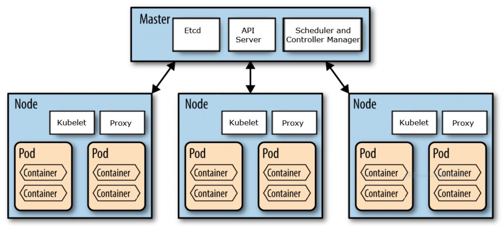

### Kubernetes Architecture 

The K8s cluster consists of two logical layers: Control Plane and Worker Plane. The Control Plane is the central cluster manager and runs all resources to manage the nodes in the worker plane. 

Worker nodes run minimal K8s administrative processes, namely the kubelet and kube-proxy. The worker nodes are generally **ephemeral or transient** and K8s will automatically reschedule workloads to available nodes if a node disappears.

Looking around the example environment:

* Show all k8s cluster nodes with details: `kubectl get nodes -o=wide`{{execute}}
* Show all container pods in the Control Plane (namespace=kube-system): `kubectl get pods -n kube-system`{{execute}}

